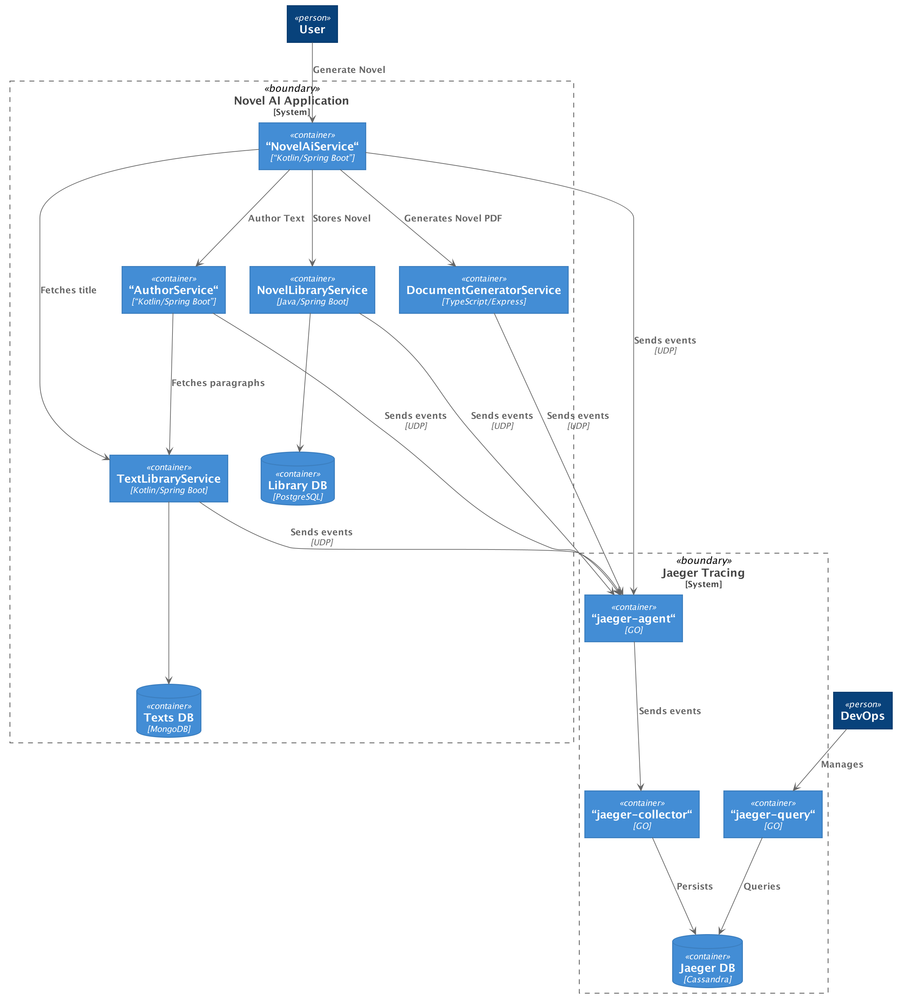

= Tracing Workbench

This projects allows to tinker with tracing by providing some services that report to a
 https://www.jaegertracing.io[Jaeger] distributed tracing system.

The application provides a service that is able to write novels which can then be exported by generating an AsciiDoc
document.

== Setup

=== Setup document-generator-service

In the `document-generator-service` folder copy the `.env.sample` file to `.env` and set values accordingly.

=== Configure Docker

In order to be able to calculate the dependencies (jaeger-spark-dependencies) set the memory that is available for
docker to at leas 2.5GiB.

== Starting the application

1. Build and start with `./gradlew clean composeUp`

If you want to force a re-build of images (in particular the text_db-seed image) run `docker-compose build`.

== Accessing Jaeger UI

The UI of Jaeger is available at: http://localhost:16686/search

== Usage

=== Create a new novel

`curl -v -X POST http://localhost:9080/novels`
 The `Location` header of the response will contain the URI where the generated
document can be retrieved.

```
$ curl -v -X POST "http://localhost:9080/novels"

*   Trying ::1...
* TCP_NODELAY set
* Connected to localhost (::1) port 9080 (#0)
> POST /novels HTTP/1.1
> Host: localhost:9080
> User-Agent: curl/7.54.0
> Accept: */*
>
< HTTP/1.1 201
< Location: /novels/4d0c0295-60da-44f8-9cb6-4abdeb4859a7
< Content-Length: 0

$ curl -v "http://localhost:9080/novels/4d0c0295-60da-44f8-9cb6-4abdeb4859a7"

*   Trying ::1...
* TCP_NODELAY set
* Connected to localhost (::1) port 9080 (#0)
> GET /novels/e41f24d3-a969-4325-b566-b0dbc4427086 HTTP/1.1
> Host: localhost:9080
> User-Agent: curl/7.54.0
> Accept: */*
>
< HTTP/1.1 200
< Content-Type: text/asciidoc;charset=UTF-8
< Content-Length: 11177
<

= sanctus

(18) Nam liber tempor cum soluta nobis eleifend option congue nihil...
```

By adding a query-parameter `m` you can chose between different methods of the authoring service.

For example the author service will do parallel calls to the _text-library_ service, when a novel
is created using `curl -v -X POST "http://localhost:9080/novels?m=p"`.

|===
| Value of query-paramter `m` | Result

| <none> or unknown value
| The _author_ will do sequential calls to the _text-library_

| p
| The _author_ will do parallel calls to the _text-library_

| f
| The _author_ will always fail with an internal exception.

| t
| The _author_ will always respond with `I AM A TEAPOD`.

|===

== Architecture
The full system is build from the following services:

novel-ai:: The main service providing API endpoints to create a new novel using the _author_ service for the content
and the _text-library_ for the title. It also has an endpoint to generate a novel document.
author:: This service authors the novel content. It uses the _text-library_ service to fetch some random paragraphs.
text-library:: A library providing a random paragraph. All available paragraphs are stored in a MongoDB database.
novel-library:: After a novel has been generated by the _novel-ai_ service this service persists the novel as structured
information in a PostgreSQL database.

All services and the Jaeger infrastructure are operated in containers using `docker-compose`.
In addition to the services and their databases the following container are utilized:

jaeger-agent:: This instance collects events to be traced from the services. The _jaeger-agent_ will forward the events
received from the services to the _jaeger-collector_
jager-collector:: This service persists the events received from the agents in a Cassandra database.
jaeger-quiery:: Provides a Web-Interface and an API that allows to query the collected traces.
cassandra-schema:: This container runs when the application starts up to initialize the Cassandra database for the
jaeger system.
jaeger-spark-dependencies:: Whenever this container is started it computes the dependencies between the services
using the traces stored in the jaeger database. This is usually run at certain times since it can be quite time and
resource consuming, depending on the amount of traces that are stored in the database.
text_db-seed:: This container is started when the application starts and initializes the text-library database.



== Updating trace dependencies

Dependencies are not calculated automatically. Instead a task has to triggered manually. There is a dedicated container,
that is responsible for that. It will exit after the task is done.

To start the container the following command can be used:
```
$ docker-compose up jaeger-spark-dependencies
```

== Debugging

All containers do expose the most important ports to localhost.
In addition the JVM-Services are also exposing a port for Remote-Debugging.

|===
| Service | API-Port | Debugging-Port

| novel-ai-service
| 9080
| 6005

| author-service
| 9081
| 6015

| text-library-service
| 9082
| 6025

| novel-library-service
| 9083
| 6035

| document-generator-service
| 9084
| 6045

|===

== Useful curls

=== Manually store a novel

```
curl -v -X PUT -H "Content-Type: application/json"\
 -d '{"authored": "2019-10-19T23:42:00Z", "title": "A title", "content": "A content"}'\
 http://localhost:9083/novels/fcea267a-31df-472a-ae0e-8afda51d648d`
```

=== Manually generate a document

```
curl -v -X POST -H "Content-Type: application/json"\
-d '{"title":"The title","content":"The content"}'\
http://localhost:9084/documents
```
